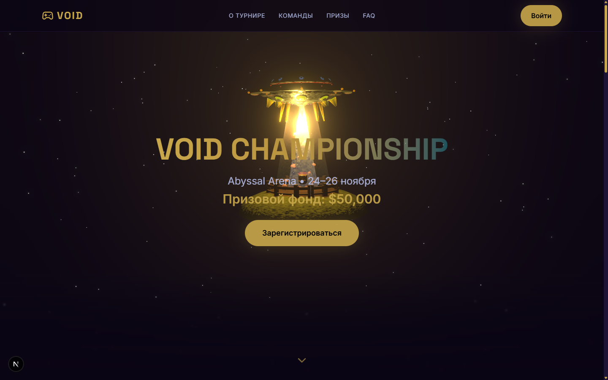

# 🕳️ Void Championship — Abyssal Arena

_Лендинг киберспортивного турнира.  
Мрачная космическая бездна, золотой акцент._

[](https://nextjs.org/)
[](https://react.dev/)
[](https://www.typescriptlang.org/)
[](https://tailwindcss.com/)
[](https://threejs.org/)
[](https://www.framer.com/motion/)
[](https://vercel.com)



## 🌌 Демо

[**void-championship.vercel.app**](https://void-championship.vercel.app/)

## 🛸 Особенности

- **Интерактивная 3D-сцена** – летающая тарелка (НЛО) с лучом энергии над клочком земли поднимая свиней, звёздное небо и пост-обработка Bloom.
- **Атмосферный прелоадер** – анимация погружения в бездну перед показом сцены.
- **Адаптивный дизайн** – mobile-first, корректное отображение на любых устройствах.
- **Система авторизации** – регистрация и вход (мок-сервис), контекст пользователя, персонализированное приветствие.
- **Плавные анимации** – Framer Motion для появления секций, карточек, мобильного меню.
- **Валидация форм** – React Hook Form + Zod, индикатор сложности пароля.
- **Типизированный код** – TypeScript во всех компонентах и утилитах.
- **Кастомная тёмная тема** – Tailwind v4 с `@theme`: глубокие фиолетовые и золотые акценты.
- **Оптимизация** – динамический импорт 3D-сцены (нет SSR), Suspense, ленивая загрузка.

## 🧱 Технический стек

- **Фреймворк:** Next.js 16 (App Router)
- **Язык:** TypeScript
- **Стили:** Tailwind CSS v4
- **3D-графика:** React Three Fiber, Drei, Postprocessing
- **Анимации:** Framer Motion
- **Формы:** React Hook Form + Zod
- **Иконки:** Lucide React
- **Деплой:** Vercel

## 🚀 Быстрый старт

```bash
# Клонируйте репозиторий
git clone https://github.com/Tomreet/void-championship.git
cd void-championship

# Установите зависимости
npm install

# Запустите dev-сервер
npm run dev
```

Откройте http://localhost:3000 в браузере.

## 📁 Структура проекта

```
public/
  ├── models/          # 3D-модели (.glb)
  └── screenshots/     # скриншоты для README
src/
  ├── app/             # роутинг (layout, page, register, login)
  ├── components/      # секции и UI-компоненты
  │   ├── hero/        # Hero с 3D-сценой
  │   ├── features/    # карточки преимуществ
  │   ├── teams/       # карточки команд
  │   ├── schedule/    # расписание матчей
  │   ├── prizes/      # призовой фонд
  │   ├── faq/         # вопросы-ответы
  │   ├── newsletter/  # форма подписки
  │   ├── layout/      # Header, Footer, MobileMenu
  │   └── ui/          # кнопки, инпуты
  ├── contexts/        # AuthContext
  ├── hooks/           # useMediaQuery, useScrollAnimation, useParallax
  ├── lib/             # данные, утилиты, валидаторы, мок-аутентификация
  └── styles/          # глобальные стили
.env.local.example     # пример переменных окружения
next.config.js
tailwind.config.ts
tsconfig.json
README.md
```

---

**Автор:** [MrKrabsArt]  
**Лицензия:** MIT